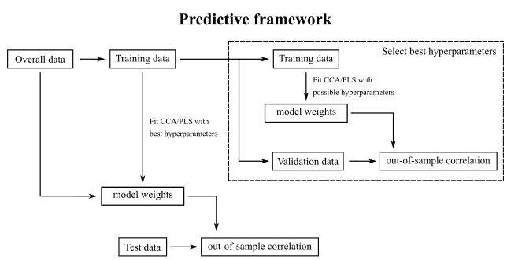

Main developer of a toolkit to indetify multivariate associations between multiple modalities of data.

The toolkit includes the following **key features**:

- several algorithms, such as Canonical Correlation Analysis (CCA), Partial Least Squares (PLS) and their regularized variants,
- computationally and memory efficient implementation,
- analysis frameworks for model selection and model inference.

### Algorithms

As demonstrated in [Mihalik et al. (2022)](../../publication/mihalik-2022/) several optimizations, such as **CCA**, 
**PLS**, **RCCA**, and **PCA-CCA**, are special cases of the following constrained optimization problem:

$$
max_{\mathbf{v}_x,\mathbf{v}_y} \text{ } \mathbf{v}_x^T\mathbf{R}_x^T\mathbf{R}_y\mathbf{v}_y
$$
$$
\text{subject to } \mathbf{v}_x^T\mathbf{R}_x^T\mathbf{R}_x\mathbf{v}_x = 1,
$$
$$
\mathbf{v}_y^T\mathbf{R}_y^T\mathbf{R}_y\mathbf{v}_y = 1
$$
$$
\text{subject to } (1-c_x)\mathbf{v}_x^T\mathbf{R}_x^T\mathbf{R}_x+c_x\mathbf{v}_x^T\mathbf{v}_x = 1,
$$
$$
(1-c_y)\mathbf{v}_y^T\mathbf{R}_y^T\mathbf{R}_y+c_y\mathbf{v}_y^T\mathbf{v}_y = 1
$$

where the original data 
(i.e., $\mathbf{X}$, $\mathbf{Y}$) 
have been transformed into principal components, 
$\mathbf{R}_x$, $\mathbf{R}_y$, 
using: 

$$
\mathbf{R}_x = \mathbf{X}\mathbf{V}_x,
$$
$$
\mathbf{R}_y = \mathbf{Y}\mathbf{V}_y
$$

where 
$\mathbf{V}_x$, $\mathbf{V}_y$ are matrices with right 
singular vectors as columns obtained from the following Singular Value Decompositions (SVDs): 

$$
\mathbf{X} = \mathbf{U}_x\mathbf{S}_x\mathbf{V}_x^T,
$$
$$
\mathbf{Y} = \mathbf{U}_y\mathbf{S}_y\mathbf{V}_y^T
$$


In **SPLS**, L1-norm regularization is added to the PLS optimization, which leads to the following 
constrained optimization problem:

$$
max_{\mathbf{w}_x,\mathbf{w}_y} \text{ } \mathbf{w}_x^T\mathbf{X}^T\mathbf{Yw}_y
$$
$$
\text{subject to } \mathbf{w}_x^T\mathbf{w}_x\le 1, ||\mathbf{w}_x||_1 \le c_x,\mathbf{w}_y^T\mathbf{w}_y\le 1,||\mathbf{w}_y||_1 \le c_y\\
$$

where the two hyperparameters, $c_x$, $c_y$, control the amount of L1-norm regularization.

### Computational efficiency

Due to the computationally efficient implementation, analysis on high-dimensional data becomes feasible, which is achieved in the following ways.

**Algorithm specific solutions:** 

1. CCA, PLS, RCCA and PCA-CCA optimizations:

- solved in a lower-dimensional transformed space instead of the original feature space
- depend on efficient data transformation allowed by a wrapper for fast SVD calculation

2. SPLS optimization:

- solved by alternating least squares with soft thresholding, which often converges quickly

**Algorithm agnostic solutions:**

1. one assosiative effect is identified at a time, which is enabled by the analysis framework using deflation

2. number of associative effects is limited to the significant associative effects, which are often low ranked (e.g., 1-3 associative effects)

3. analysis can be run in a cluster environment to speed up computationally intensive tasks (e.g., hyperparameter optimization) using a custom solution

### Frameworks

Two analysis frameworks are provided.

In the **descriptive framework**, the model is fitted on the entire data and the resulting model weights are used to compute in-sample correlation.
To allow hyperparameter selection (e.g., choosing the number of principal components in PCA-CCA), and to assess the number of significant associative effects, an in-sample permutation based approach is provided. In addition, a bootstrapping procedure is provided to help the interpretation of model weights.

   

In the **predictive (or machine learning) framework**, the model is fitted on a training set and evaluated on a holdout set, and the statistical inference is based on out-of-sample correlation. Hyperparameters (e.g., amount of regularization) are selected based on splitting of the training set further into inner training sets and validation sets multiple times. To assess the number of significant associative effects, an out-of-sample permutation based approach is provided.

   

### Related papers

1. [Rachel L. Smith, Agoston Mihalik, Nirmala Akula, ..., Francis J. McMahon (2025)](../../publication/smith-2025/)

- GRCCA: a novel interpretable ML algorithm using structured regularization

- bootstrapping procedure to help the interpretation of model weights

2. [Agoston Mihalik, James Chapman, Rick A. Adams, ..., Janaina Mourão-Miranda (2022)](../../publication/mihalik-2022/)

- theoretical and practical introduction to the most commonly used CCA/PLS models and their regularized variants

- mathematical details of aforementioned CCA/PLS optimizations and their computational efficient solutions

3. [Agoston Mihalik, Fabio S. Ferreira, Michael Moutoussis, ..., Janaina Mourão-Miranda (2020)](../../publication/mihalik-2020/)

- innovative ML framework using stability criterion for regularized CCA/PLS approaches

<!--more-->
